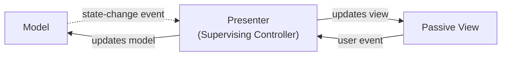
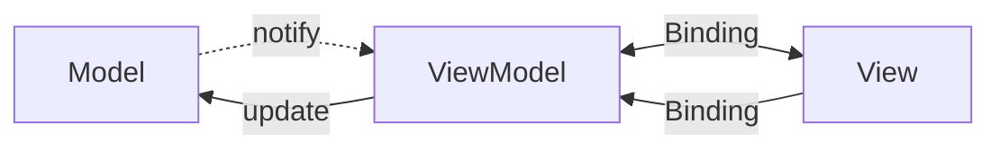
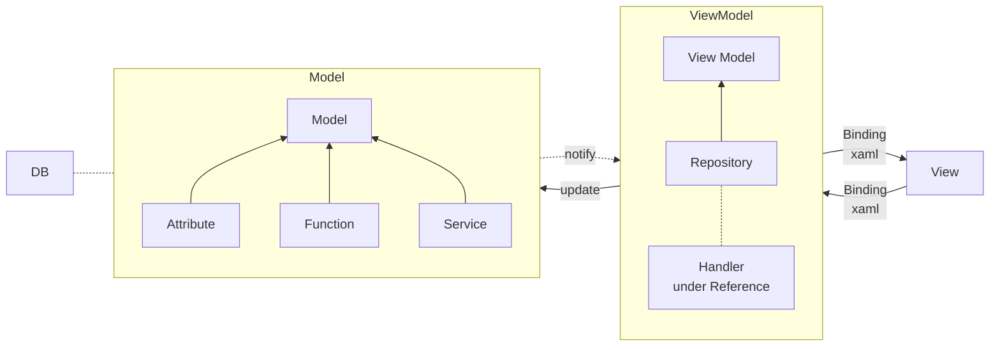

# Architectural pattern

## MVP

```mermaid
graph LR;
    M[Model]
    P["Presenter<br>(Supervising Controller)"]
    V["Passive View"]
    M -.-> |"state-change event"| P;
    P --> |"updates model"| M
    V --> |"user event"| P
    P --> |"updates view"| V

```

## MVVM

```mermaid
graph LR;
    M[Model]
    VM[ViewModel]
    V[View]
    M -.-> |notify| VM;
    VM --> |update| M
    V --> |Binding| VM
    VM <--> |Binding| V
```

## 

```mermaid
flowchart LR;
    V[View]
    M[Model]
    R[Repository]
    Hd[Handler<br>under Reference]
    Model -.-> |notify| ViewModel --> |"Binding<br>xaml"| V
    ViewModel --> |update| Model
    V --> |"Binding<br>xaml"| ViewModel
    DB -.-Model
    subgraph ViewModel
        direction BT
        R --> VM[View Model]
        Hd -.- R
    end
    subgraph Model
        direction BT
        Attribute --> M
        Function --> M
        Service --> M
    end

```

