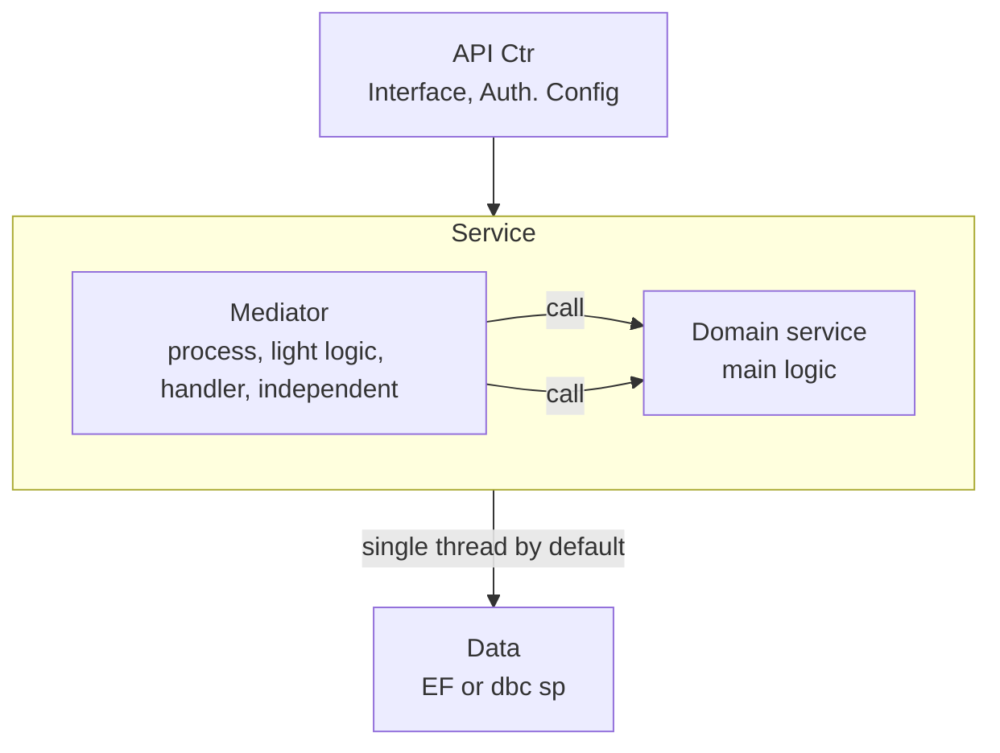

## Structure

* data.model : auto gen
* data.ExtendedModel : manual, e.g. sp
* jwt token
  * permission control (AuthSchemes, Policy)
    * fix name ( auth_sp|xxxxxx), 
      * xxxx is funcCode and action types with comma separator
    * RIUD for action type check
      * record state check
  * except refresh token, as jwt invalid at the time
* Rt :
  * List
  * RowID
* api body
  * lastUpdDt
    * last response time
    * use for check time gap in between of conflict
